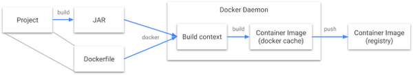

# Beginning Kubernetes Workshop

This workshop will guide you through deploying a couple of of applications to a local Kubernetes cluster that you will run using Docker's Kubernetes feature.

You will learn how to create deployments, expose services, update and rollback a deployment, and use Kubernetes' built-in service discovery feature.

You will also work with a few tools such as Skaffold and Kustomize that make deployment and configuration easier.

**If you're following along, make sure you fork this repository and then clone it as you will be making changes to the code**

--------

### Prerequisites

 - JDK 8 or higher (you probably already have this)
 - [Docker](https://docs.docker.com/get-docker/) Desktop installed (you probably already have this)
 - [Kustomize](https://github.com/kubernetes-sigs/kustomize/tree/master/docs)
 - [Skaffold](https://skaffold.dev/docs/install/)
 - (Optional) [Cloud Code](https://cloud.google.com/code/) - a handy IDE extension available for IntelliJ and VS Code
 - (Optional) watch - a command line tool that will let us watch our cluster in real time. On a mac you can install it with `brew install watch`

You'll also want to have a Docker repo where you can push/pull images. For the purposes of this demo, you can create a free [DockerHub](https://hub.docker.com/) account. This will avoid nuisances with authentication for the purposes of this simple demo.

---

### Set up Docker and kubectl

kubectl is the Kubernetes command line tool used to orchestrate a cluster, deployments, services, etc.

Open your Docker Desktop preferences, click on the Kubernetes section and check the Enable Kubernetes checkbox.

Once Docker has finished booting your Kubernetes cluster, verify kubectl is installed by running the following:

    kubectl version

You should see output similar to:

    Client Version: version.Info{Major:"1", Minor:"15", GitVersion:"v1.15.5", GitCommit:"20c265fef0741dd71a66480e35bd69f18351daea", GitTreeState:"clean", BuildDate:"2019-10-15T19:16:51Z", GoVersion:"go1.12.10", Compiler:"gc", Platform:"darwin/amd64"}
    Server Version: version.Info{Major:"1", Minor:"15", GitVersion:"v1.15.5", GitCommit:"20c265fef0741dd71a66480e35bd69f18351daea", GitTreeState:"clean", BuildDate:"2019-10-15T19:07:57Z", GoVersion:"go1.12.10", Compiler:"gc", Platform:"linux/amd64"}

Ensure that kubectl is using your Docker context:

    ○ → kubectl config get-contexts
    CURRENT   NAME                 CLUSTER          AUTHINFO         NAMESPACE
    *         docker-desktop       docker-desktop   docker-desktop
              docker-for-desktop   docker-desktop   docker-desktop
              minikube             minikube         minikube

If CURRENT indicates that you are using something other than docker-desktop, run the following:

    kubectl config use-context docker-desktop

---

### Running the Spring Boot demo App

Verify you can run the kube-demo application (ignore kube-service-demo for now) by running

    ./gradlew bootrun

in the root of the kube-demo application. Visit `localhost:8080` to verify that the application responds.

Also verify that the actuator endpoints are running:

    ○ → curl localhost:8080/actuator
    {"_links":{"self":{"href":"http://localhost:8080/actuator","templated":false},"health":{"href":"http://localhost:8080/actuator/health","templated":false},"health-path":{"href":"http://localhost:8080/actuator/health/{*path}","templated":true},"info":{"href":"http://localhost:8080/actuator/info","templated":false}}}

We'll use these routes later when we demonstrate Kubernetes' health checking features.

---

### Containerize The App

We'll use [Jib](https://github.com/GoogleContainerTools/jib) to containerize our application. Jib makes building docker containers easier. It runs as a Maven or Gradle plugin, does not require a Docker daemon, and implements many Docker best practices automatically.

Traditional Docker build flow:


Building a container with Jib:


Add the plugin and configuration to your `build.gradle.kts`

    plugins {
	    id("com.google.cloud.tools.jib") version "2.1.0"
	}

You can now configure Jib to build your container:

    jib {
	    from {
		    image = "openjdk:11.0.6-slim"
		}
		to {
			image = "your-docker-repo/kube-demo-app"
			tags = setOf("v1")
		}
		container {
			user = "nobody:nogroup"
		}
	}

Replace `your-docker-repo` with your DockerHub username. You can also select whatever jdk image you'd like for your container.

You can now build your container by running:

    ./gradlew jibDockerBuild

You should see the image in your image list:

    → docker images
    REPOSITORY                           TAG                 IMAGE ID            CREATED             SIZE
    docker/desktop-storage-provisioner   v1.0                605a0f683b7b        5 weeks ago         33.1MB
    k8s.gcr.io/kube-apiserver            v1.15.5             e534b1952a0d        5 months ago        207MB
    k8s.gcr.io/kube-controller-manager   v1.15.5             1399a72fa1a9        5 months ago        159MB
    k8s.gcr.io/kube-proxy                v1.15.5             cbd7f21fec99        5 months ago        82.4MB
    k8s.gcr.io/kube-scheduler            v1.15.5             fab2dded59dd        5 months ago        81.1MB
    docker/kube-compose-controller       v0.4.23             a8c3d87a58e7        10 months ago       35.3MB
    docker/kube-compose-api-server       v0.4.23             f3591b2cb223        10 months ago       49.9MB
    k8s.gcr.io/coredns                   1.3.1               eb516548c180        15 months ago       40.3MB
    k8s.gcr.io/etcd                      3.3.10              2c4adeb21b4f        16 months ago       258MB
    k8s.gcr.io/pause                     3.1                 da86e6ba6ca1        2 years ago         742kB
    jrossmeisl/kube-demo-app             latest              f90b71290d56        50 years ago        425MB

You'll see it as `your-docker-repo/kube-demo-app` and no I don't know why it was created 50 years ago 🙃

Finally, we can build the container and push it to DockerHub:

    ./gradlew jib

Go to your repositories page in DockerHub to verify that the repository now exists.

If you want, you can make sure you update your repo every time you build your project (build.gradle.kts):

    tasks {
	    build {
		    dependsOn(jib)
		}
	}

---

# Kubernetes Time

Now we're ready to dive into using Kubernetes to deploy our apps.

## Kubernetes concepts

### Clusters and Nodes

A Kubernetes cluster consists of a master process and at least one node process:


The master coordinates the entire cluster. This includes scheduling applications, maintaining applications' desired state, scaling applications, and rolling out new updates.

A node is a worker and holds instances of applications and manages them. Nodes must have a container runtime (like Docker)

Let's check out our running Kubernetes cluster:

    → kubectl cluster-info
    Kubernetes master is running at https://kubernetes.docker.internal:6443
    KubeDNS is running at https://kubernetes.docker.internal:6443/api/v1/namespaces/kube-system/services/kube-dns:dns/proxy

    → kubectl get nodes
    NAME             STATUS   ROLES    AGE   VERSION
    docker-desktop   Ready    master   6d    v1.15.5

---

### Deployments

A Kubernetes Deployment configuration tells Kubernetes how to create and update instances of an application. The Kubernetes master will schedule instances of your application onto nodes in the cluster. The Kubernetes Deployment Controller continuously monitors application instances, rescheduling them on other nodes should the node they are running on go down.


Let's create a deployment for our demo application. Inside the `kube-demo` folder, execute the following:

    → mkdir k8s
    → kubectl create deployment kube-demo-app --image your-docker-repo/kube-demo-app:v1 -o yaml --dry-run > k8s/deployment.yml

This command performs a dry run and outputs the deployment configuration into a yaml file. The resulting `deployment.yml` file should look like this:

    apiVersion: apps/v1  
    kind: Deployment  
    metadata:  
      creationTimestamp: null  
      labels:  
        app: kube-demo-app  
      name: kube-demo-app  
    spec:  
      replicas: 1  
      selector:  
        matchLabels:  
          app: kube-demo-app  
      strategy: {}  
      template:  
        metadata:  
          creationTimestamp: null  
          labels:  
            app: kube-demo-app  
        spec:  
          containers:  
          - image: your-docker-repo/kube-demo-app  
            name: kube-demo-app  
            resources: {}  
    status: {}

Note the `label:` and `selector: matchLabels:` entries. Labels and label selectors are used to associate application instances to a deployment. As we will see, they'll also be used to create services which expose our application outside the cluster.

Now let's actually apply our deployment. In a new terminal, run

    → watch -n 1 kubectl get all

This will show the state of the cluster every 1 second which will allow us to watch how the cluster responds to our activity. Initially, you'll only see the default kubernetes service running in the cluster:

    Every 1.0s: kubectl get all
    
    NAME                 TYPE        CLUSTER-IP   EXTERNAL-IP   PORT(S)   AGE
    service/kubernetes   ClusterIP   10.96.0.1    <none>        443/TCP   6d1h

Next, apply the deployment:

    → kubectl apply -f ./k8s

In your `watch` tab, you'll see the deployment come online:

    NAME                                 READY   STATUS    RESTARTS   AGE
    pod/kube-demo-app-57c6dbf86b-878dq   1/1     Running   0          11m
    
    
    NAME                 TYPE        CLUSTER-IP   EXTERNAL-IP   PORT(S)   AGE
    service/kubernetes   ClusterIP   10.96.0.1    <none>        443/TCP   6d1h
    
    
    NAME                            READY   UP-TO-DATE   AVAILABLE   AGE
    deployment.apps/kube-demo-app   1/1     1            1           11m
    
    NAME                                       DESIRED   CURRENT   READY   AGE
    replicaset.apps/kube-demo-app-57c6dbf86b   1         1         1       11m

Although our application is running, we cannot access it directly. We'll get to that later, but for now we can use Kubernetes' built-in port forwarding to access it. Replace the kube-demo-app pod name with the actual name of the pod in your cluster (`pod/kube-demo-app-random-id`) in the above output

    → kubectl port-forward kube-demo-app-57c6dbf86b-878dq 8080

You should now be able to visit `localhost:8080` and get a response from the application.

Now, let's dig in to our deployment a bit.

---

### Pods and Nodes

Pods are the atomic unit in the Kubernetes platform. A pod represents a group of one or more application containers (such as Docker) and some shared resources for those containers, such as:

 - Shared storage, as Volumes
 - Networking, as a unique cluster IP address
 - Container information such as the container image version or specific ports to use

Think of a pod as a "logical host" for an application. They can contain different application containers which are relatively tightly coupled, but often will contain only your running (Spring) application.

Pod examples:


Pods always run on a Node. As previously mentioned, a Node is a worker machine and can be either virtual or physical, depending on the cluster. Nodes can run multiple pods. The Kubernetes Master schedules pods to run on Nodes across the cluster.

A closer look at a Node:


The `kubectl describe` command will output human readable information about a resource. For example, `kubectl describe pods` will tell us all about the pods in our cluster (we only have one). Try running the command, and you'll see the name of the pod, its status, all of the containers it is running (here, just one container, our application), pod events, and much more.

To get the logs for your pod, you can run `kubectl logs <pod-name>`. The pod-name can be gotten from the describe command output. Since we only have one container running in the pod, we don't have to specify container name.

You can also execute commands inside the pod. For example, try:

    kubectl exec -ti <pod-name> bash

This will open a shell inside the container running in the pod. Exit out of this shell.

---

### Services

Because pods have lifecycles and can come and go as nodes start and stop, and because there may be many instances of your application (pods), accessing them directly simply cannot work.

A Kubernetes service is basically a logical grouping of pods that also defines a policy by which to access them. Practically, services can be used to expose an application that has many running instances and act as a load balancer across the replica set.

Usually, services are created with label selectors to choose the pods that will be included in the service, but this isn't required (we'll use selectors for our services).

Services and labels:


Run the following to generate a service configuration for our cluster:

    kubectl create service loadbalancer kube-demo-app --tcp 80:8080 -o yaml --dry-run > k8s/service.yml

The generated configuration looks something like this:

    apiVersion: v1  
    kind: Service  
    metadata:  
      creationTimestamp: null  
      labels:  
        app: kube-demo-app  
      name: kube-demo-app  
    spec:  
      ports:  
      - name: 80-8080  
        port: 80  
        protocol: TCP  
        targetPort: 8080  
      selector:  
        app: kube-demo-app  
      type: LoadBalancer  
    status:  
      loadBalancer: {}

Apply the service to the cluster:

    kubectl apply -f ./k8s

In your `watch` terminal, you'll a new service entry alongside the default `service/kubernetes` that should look like:

    NAME                    TYPE           CLUSTER-IP     EXTERNAL-IP   PORT(S)        AGE
    service/kube-demo-app   LoadBalancer   10.96.213.48   localhost     80:31421/TCP   56s

In a cloud-hosted Kubernetes cluster, the external IP will not be localhost. Visit `localhost` directly and you should get a response from the application through the service!

---

### Liveness and Readiness Probes

Kubernetes has two built-in probes that help it determine if your app is alive. If the readiness probe does not return `200` then no traffic will route to it. If the liveness probe does not return `200` then Kubernetes will restart the pod. We can map the `/health` and `/info` actuator endpoints to these probes.

Open `k8s/deployment.yml` and add the liveness and readiness probes:

    apiVersion: apps/v1
    kind: Deployment
    metadata:
      ...
      name: k8s-demo-app
    spec:
    ...
      template:
        ...
        spec:
          containers:
            ...
            readinessProbe:
              httpGet:
                port: 8080
                path: /actuator/health
            livenessProbe:
              httpGet:
                port: 8080
                path: /actuator/info

Apply the updated deployment:

    kubectl apply -f ./k8s

In your `watch` terminal, you'll see a new pod get created and the old one get terminated (note that Kubernetes waits for the new pod to pass its readiness check before terminating the old one).

---

### Scaling the Deployment

Now we'll scale our application up to run multiple instances (pods). Kubernetes supports autoscaling, but we won't get into that. You can read about it [here](https://kubernetes.io/docs/tasks/run-application/horizontal-pod-autoscale/) if you're interested.

The service that we started has an integrated load balancer that will distribute traffic across all pods in the deployment.

Two things to notice in your `watch` terminal are the deployment and the replicaset entries:

    NAME                            READY   UP-TO-DATE   AVAILABLE   AGE
    deployment.apps/kube-demo-app   1/1     1            1           25h

    NAME                                       DESIRED   CURRENT   READY   AGE
    replicaset.apps/kube-demo-app-65bfcf677d   1         1         1       16m

The deployment entry shows we have 1/1 ready pods, the replicaset shows us the number of DESIRED replicas of our application as well as the CURRENT number of replicas running.

Let's scale the deployment up to 4 replicas:

    → kubectl scale deployments/kube-demo-app --replicas=4

Your `watch` tab will become busy as Kubernetes boots 3 new pods and updates their statuses as they become ready.

Until now, when we hit `localhost` we always see the same value for `My name is`. This is because we have only been running a single instance (the name is the name of the pod that receives the request). Run `curl http://localhost` repeatedly to see the service distribute traffic across the pods in the replicaset.

---

### Rolling updates

Kubernetes has built-in support for rolling updates and rollbacks. By default, the maximum number of unavailable pods and pods that can be created during an update is 1, but this can be configured.

All pods on v1:


Removing and creating pod:


Updating another node:


Update complete:


To see this in action, let's push up a new version of our app. Update `hello` method in the `HelloController`:

    @GetMapping("/")  
    fun hello(): String {  
        return "Ahoy, matey! My name be ${System.getenv("HOSTNAME")}"  
    }

Change the tag in the destination repo in your `build.gradle.kts`:

    jib {  
      from {  
	      image = "openjdk:11.0.6-slim"  
      }  
      to {  
	      image = "jrossmeisl/kube-demo-app"
	      tags = setOf("v2")
      }  
      container {  
	      user = "nobody:nogroup"  
      }  
    }

Run `./gradlew jib` (or `./gradlew build` if you set up `build` to depend on `jib` to push a new v2 image with our changed controller.

Now we can tell our 4-pod cluster to perform a rolling update to the new version:

    → kubectl set image deployments/kube-demo-app kube-demo-app=your-docker-repo/kube-demo-app:v2

 Observe how the deployment rolls across your cluster in your `watch` tab. Once the deployment is complete, run `curl http://localhost` and verify the app has been updated.

---

### Rolling back an update

When an update fails, Kubernetes provides an easy way to roll the cluster back to the previous state. Run the following:

    → kubectl set image deployments/kube-demo-app kube-demo-app=your-docker-repo/kube-demo-app:badimage

Whoops, the update didn't complete successfully. In your `watch` tab, you'll notice that Kubernetes is attempting to create a new pod, but is failing because it can't find the image we just told it to use. The good news is that our application is still up, as it does not attempt to replace the next pod until it can replace the first one.

To get out of this state let's run:

    → kubectl rollout undo deployments/kube-demo-app

You'll see that Kubernetes re-creates the failing pod with the previous state, and we've successfully rolled back our failed update.

Let's clean up by running `kubectl delete -f ./k8s`

---

## Introducing Skaffold and Kustomize

Now that we've gained some understanding of `kubectl` and how it can be used to manage an application deployment, let's examine a couple of tools that can make our lives easier.

### Skaffold

Skaffold is a command line tool that provides us with a great foundation for continuous development as well as CI/CD.

Let's generate a Skaffold configuration:

    → skaffold init --XXenableJibInit

You'll see output like

    apiVersion: skaffold/v2beta1
    kind: Config
    metadata:
      name: kube-demo
    build:
      artifacts:
      - image: your-docker-repo/kube-demo-app
        jib: {}
    deploy:
      kubectl:
        manifests:
        - k8s/deployment.yml
        - k8s/service.yml
    
    Do you want to write this configuration to skaffold.yaml? [y/n]: y
    Configuration skaffold.yaml was written
    You can now run [skaffold build] to build the artifacts
    or [skaffold run] to build and deploy
    or [skaffold dev] to enter development mode, with auto-redeploy

The `--XXenableJibInit` flag is required for Skaffold to pick up our Jib image configuration.

Now, we can deploy our app to Kubernetes with this simple command:

    → skaffold dev

In your `watch` tab, notice how the same resources are created as before. You can `curl http://localhost` if you want to verify the app.

Since we're running in `dev` mode, Skaffold is watching our file for changes. So let's change our controller method again:

    @GetMapping("/")  
    fun hello(): String {  
        return "Oh, hey. I'm ${System.getenv("HOSTNAME")}"  
    }

When you save the file, you'll see Skaffold rebuild the application and then deploy the new version to the cluster. Once the new pod is up and running, `curl http://localhost` to verify the update.

When you kill the Skaffold process, it will clean up after itself by removing the deployment and service.

### Kustomize

Kustomize is a handy tool that lets us customize our deployments for different environments. We can start with a base/default configuration and apply customizations on top of those (similar to Spring Boot's application-env.properties/yml system).

First, we'll migrate our configuration into a kustomize folder:

    → mkdir -p kustomize/base
    → mv k8s/* kustomize/base
    → rm -Rf k8s

Create a file called `kustomization.yml` in `kustomize/base` and add the following to it:

```
apiVersion: kustomize.config.k8s.io/v1beta1
kind: Kustomization

resources:	
- service.yml
- deployment.yml
```

Now let's say we have a qa environment where we want to run 2 instances of our application. In the `kustomize` directory, create a new directory called `qa`. In this new `kustomize/qa` directory, make a file called `update-replicas.yml`. This file will hold our customizations for our qa environment.

Add the following to `kustomize/qa/update-replicas.yml`:

```
apiVersion: apps/v1
kind: Deployment
metadata:
  name: kube-demo-app
spec:
  replicas: 2
```

Now add a `kustomization.yml` file in `kustomize/qa` with the following content:

```
apiVersion: kustomize.config.k8s.io/v1beta1
kind: Kustomization

resources:
- ../base

patchesStrategicMerge:
- update-replicas.yml
```

This file tells Kustomize to take the configuration in `kustomize/base` and replace only the specific properties we've defined in `update-replicas.yml`.

Now we can build our deployment:

    → kustomize build ./kustomize/base

The output of this will be the complete configuration for our deployment and service.

We can pipe this output to `kubectl` to deploy our application to our Kubernetes cluster:

    → kustomize build ./kustomize/base | kubectl apply -f -

You should see the deployment spin up in your `watch` terminal. Let's build our qa configuration and deploy that instead:

    → kustomize build ./kustomize/qa | kubectl apply -f -

You'll see the deployment update to run 2  instances of the application.
Let's clean up the deployment and move on

    → kustomize build ./kustomize/qa | kubectl delete -f -

---

### Kustomize and Skaffold

By default, Skaffold  uses `kubectl` to deploy artifacts, but it can be configured to use `kustomize`. To do this, let's modify our `skaffold.yaml`:

    apiVersion: skaffold/v2beta1  
    kind: Config  
    metadata:  
      name: kube-demo  
    build:  
      artifacts:  
      - image: jrossmeisl/kube-demo-app  
        jib: {}  
    deploy:  
      kustomize:  
        paths: ["kustomize/base"]  
    profiles:  
      - name: qa  
        deploy:  
          kustomize:  
            paths: ["kustomize/qa"]

We've updated the `deploy` property to use `kustomize` instead of `kubectl`. Additionally, we've added a `profiles` section that allows us to deploy our qa configuration.

We can run our default application as we did before:

    → skaffold dev

If we want to run our `qa` profile, we can tell Skaffold to use that profile instead:

    → skaffold dev -p qa

Terminate the `skaffold` process and let's move on.

---

### Externalized Configuration

Externalizing configuration is one of the famous 12 factors for cloud native apps we always talk about. Kubernetes has config maps and secrets to support externalizing configuration. Let's use `kubectl` to create a config map:

    → kubectl create configmap log-level --from-literal=LOGGING_LEVEL_ORG_SPRINGFRAMEWORK=DEBUG

Log level isn't a particularly exciting bit of configuration but it will be easy to see the effects in action. We can take a look at the config map we just created:

    → kubectl get configmap log-level -o yaml
    apiVersion: v1
    data:
      LOGGING_LEVEL_ORG_SPRINGFRAMEWORK: DEBUG
    kind: ConfigMap
    metadata:
      creationTimestamp: "2020-04-13T22:00:15Z"
      name: log-level
      namespace: default
      resourceVersion: "788415"
      selfLink: /api/v1/namespaces/default/configmaps/log-level
      uid: 76313b9a-bc5f-438c-a353-1297c25fc6cf

#### Using config maps in our application

The easiest way to consume config maps is probably to use environment variables. Let's change our `deployment.yml` in `kustomize/base`:

```
apiVersion: apps/v1
kind: Deployment
...
spec:
  ...
  template:
    ...
    spec:
      containers:
      - image: your-docker-repo/kube-demo-app:v1
        name: kube-demo-app
        envFrom:
          - configMapRef:
              name: log-level
        ...
```
The `envFrom` property loads environment variables defined in the referenced config map. Run `skaffold dev` to update the deployment. You should see much more verbose output logging output from the application.

Go ahead and remove the `envFrom` property in `deployment.yml` and delete the config map we created:

    → kubectl delete configmap log-level

#### Using config maps with Spring Boot

Spring Boot configuration is normally placed in `application.yml` or `application.properties`. We can use `kubectl` to create Kubernetes config maps from our app configuration:

    → kubectl create configmap k8s-demo-app-config --from-file ./path/to/application.yml

We won't actually do this though, because there is a better way, using Kustomize.

First, create a file called `application.yml` in `kustomize/base`:

    logging:  
      level:  
        org:  
          springframework: INFO

Now we'll configure Kustomize to generate a config map from this file. Add a `configMapGenerator` to the end of `kustomize/base/kustomization.yml`:

    configMapGenerator:  
      - name: kube-demo-app-config  
        files:  
          - application.yml

Run a Kustomize build and observe the config map configuration that it creates:

    → kustomize build kustomize/base/
    apiVersion: v1
    data:
      application.yml: |-
        logging:
          level:
            org:
              springframework: INFO
    kind: ConfigMap
    metadata:
      name: kube-demo-app-config-b46mgmmhmc

Notice that Kustomize generates a random name suffix for the `ConfigMap`. Kustomize reconciles this name whenever the `ConfigMap` is referenced in other places. This is to force a change to the `Deployment` and in turn force Kubernetes to restart the application. This might not always be desirable (i.e. the `ConfigMap` and the `Deployment` aren't in the same `Kustomization`). Setting `behavior` to `merge` or `replace` in the `configMapGenerator` will prevent this.

Modify your deployment (`kustomize/base/deployment.yml`) so that Kubernetes will create a volume for the config map and mount it in the container (replace the `envFrom` property):

```
apiVersion: apps/v1
kind: Deployment
...
spec:
   ...
  template:
    ...
    spec:
      containers:
      - image: your-docker-repo/kube-demo-app
        name: kube-demo-app
        volumeMounts:
          - name: config-volume
            mountPath: /config
        ...
      volumes:
        - name: config-volume
          configMap:
            name: kube-demo-app-config
```

Here, we're defining a volume named `config-volume` from the config map named `kube-demo-app-config` (defined in the `configMapGenerator` in `kustomize/base/kustomization.yml`). We're mounting this volume at the path `/config` which will be seen by Spring Boot, since it looks for a `./config` directory and will load configuration from there if it finds it.

Now let's run the deployment with our config map with `skaffold dev`. Once the deployment is up and running, verify that the config map was generated:

    → kubectl get configmap
    NAME                              DATA   AGE
    kube-demo-app-config-b46mgmmhmc   1      41s

Finally, change `logging.level.org.springframework` from `INFO` to `DEBUG`. You'll see Skaffold detect the change, create a new config map, and restart the pod. When the application boots back up, there will be much more logging output.

Go ahead terminate the Skaffold process.

---

### Service Discovery

The last thing we'll do is show Kubernetes' service discovery.

Kubernetes has easy built-in support for service discovery. Each service will be given a DNS entry in the containers of the other services. For example, if we have another service called `kube-demo-name-service` we can make an HTTP request to it at `http://kube-demo-name-service`.

#### Deploy The Name Service App

By now you've probably noticed the `kube-service-demo` app in this repository. It has a single endpoint that returns a random name from a predefined list. Let's build and push the service app up do our docker repo by running `./gradlew jib` or `./gradlew build`. The service application is already configured to use jib. Go to your Docker Hub page and verify that there is now a repository there named `your-docker-repo/kube-demo-service-app`.

Open up `kube-service-demo/kustomize/base/deployment.yml` and update this area

    spec:  
      containers:  
        - image: your-docker-repo/kube-demo-service-app  
          name: kube-demo-name-service  
          resources: {}

by changing `your-docker-repo` to your real Docker Hub location.

Modify `kube-demo/kustomize/base/kustomization.yml` by adding the service app as a resource:

```
apiVersion: kustomize.config.k8s.io/v1beta1
kind: Kustomization

resources:
  - service.yml
  - deployment.yml
  - ../../../kube-service-demo/kustomize/base

configMapGenerator:
  - name: kube-demo-app-config
    files:
      - application.yml
```

We'll also make a new version of our demo app to make a call to the service. Update the `hello()` method inside our `HelloController`:

    @GetMapping("/")  
    fun hello(): String {  
        return "Greetings!. I am ${System.getenv("HOSTNAME")}. And you are ${rest.getForObject("http://kube-demo-name-service", String::class.java)}, I presume?"  
    }
     
Also, update the `tags` in your `jib` task in `build.gradle.kts`:

    tags = setOf('v3')
 
Now, when you run `skaffold dev`, it will deploy both of the applications. You should see something similar to the following in your `watch` terminal (if you are no longer running `watch` in separate terminal, you can run `kubectl get all` to see the state of the cluster):

    NAME                                          READY   STATUS    RESTARTS   AGE
    pod/kube-demo-app-5b4c988bfc-zt99n            1/1     Running   1          7m27s
    pod/kube-demo-name-service-79cbd78bc4-fc9dq   1/1     Running   0          7m27s
    
    NAME                             TYPE           CLUSTER-IP      EXTERNAL-IP   PORT(S)        AGE
    service/kube-demo-app            LoadBalancer   10.105.21.230   localhost     80:31537/TCP   7m27s
    service/kube-demo-name-service   ClusterIP      10.101.56.125   <none>        80/TCP         7m27s
    service/kubernetes               ClusterIP      10.96.0.1       <none>        443/TCP        14d
    
    NAME                                     READY   UP-TO-DATE   AVAILABLE   AGE
    deployment.apps/kube-demo-app            1/1     1            1           7m27s
    deployment.apps/kube-demo-name-service   1/1     1            1           7m27s
    
    NAME                                                DESIRED   CURRENT   READY   AGE
    replicaset.apps/kube-demo-app-5b4c988bfc            1         1         1       7m27s
    replicaset.apps/kube-demo-name-service-79cbd78bc4   1         1         1       7m27s

You can see both deployments, services and pods (apps) are running. Test that we are making the API call to the service:

    → curl localhost
    Greetings!. I am kube-demo-app-5b4c988bfc-zt99n. And you are Stanley, I presume?

Running this command repeatedly should produce different names, as they are fetched from `kube-demo-name-service`.

Clean up by running `kubectl delete -f ./k8s`

You might also want to clean up the docker images that are now floating around on your machine:

	docker system prune -a

---

### Hooray!

Well, we just took quite a grand tour of some of the fundamentals of deploying containerized Spring Boot apps to a Kubernetes cluster.

We saw how to deploy, scale, and expose applications outside of a cluster. We looked at couple of tools that can streamline the development, containerization, and configuration of applications that run on Kubernetes. Finally, we saw how we can use Kubernetes' service discovery to make requests to other applications running in our cluster without needing to know their IP addresses.

---

### Next Steps

Much of this content was inspired by the docs over at [the official Kubernetes website](https://kubernetes.io/docs/home/).

The website [Katacoda](https://www.katacoda.com/courses/kubernetes) has a series of courses where you can learn various scenarios in an entirely browser-based Kubernetes environment.

If you really think you love Kubernetes, you can train for the [Certified Kubernetes Application Developer](https://www.cncf.io/certification/ckad/) or even the [Certified Kubernetes Administrator](https://www.cncf.io/certification/cka/) exams.

Thank you! I hope you enjoyed this workshop and that you learned something.
